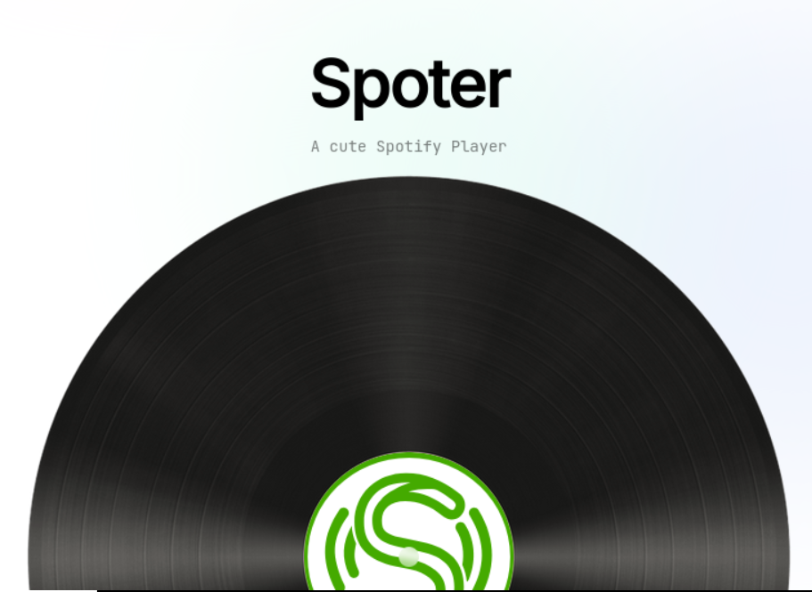
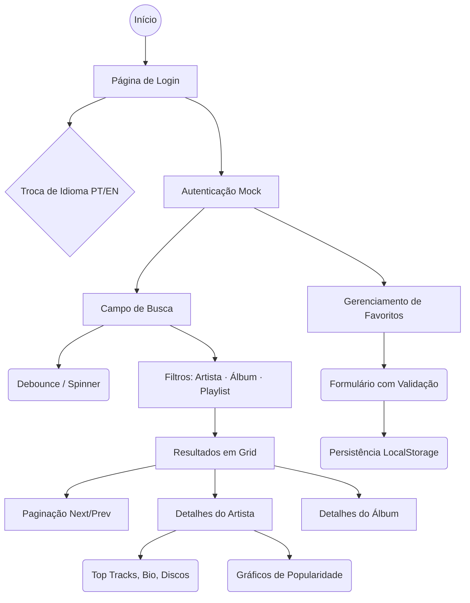

<p align="center">
  
</p>

# Spoter (Hiring Challenge)

Spoter é um player de música web imersivo integrado com a API do Spotify, utilizando React, TypeScript, Vite, Tailwind CSS e Shadcn/UI com "Glassmorfismo".

**Link:** https://spoter.jeansouza.dev/
(se for testar aqui, me mande o email cadastrado no spotify para liberação)

## Configuração do Spotify (Obtendo o Client ID)

Para que a autenticação e as chamadas à API funcionem, você precisa de um **Client ID** do Spotify e configurar o Redirect URI. Siga os passos abaixo:

1. **Acesse o Dashboard de Desenvolvedor do Spotify:**
   Vá para [developer.spotify.com/dashboard](https://developer.spotify.com/dashboard) e faça login com a sua conta do Spotify.

2. **Crie uma aplicação (Create app):**
   - Preencha o nome (ex: `Spoter Local`) e a descrição.
   - Em **Redirect URIs**, insira exatamente: `http://127.0.0.1:5173/callback`
     - `https://localhost...` não funciona pois o spotify não aceita `localhost` apenas `127.0.0.1`
   - Marque as opções necessárias e aceite os termos para criar o app.

3. **Copie o Client ID:**
   Na página da sua nova aplicação, clique em **Settings** (Configurações) e copie a string alfanumérica em **Client ID**.

4. **Configure o `.env`:**
   No diretório raiz do projeto, crie ou edite o arquivo `.env` (use o `.env.example` como base) e adicione seu Client ID:

   ```bash
   VITE_SPOTIFY_CLIENT_ID=cole_seu_client_id_aqui
   VITE_SPOTIFY_REDIRECT_URI=http://127.0.0.1:5173/callback
   ```

## Executando o Projeto

1. Instale as dependências:
   ```bash
   yarn
   ```

2. Inicie o servidor de desenvolvimento:
   ```bash
   yarn dev
   ```

> **Aviso de HTTPS Local:** O projeto usa o `@vitejs/plugin-basic-ssl` para gerar um certificado autoassinado (obrigatório para algumas APIs web e integrações OAuth avançadas). O navegador exibirá um aviso de "Sua conexão não é privada". Clique em **Avançado** e **Ir para localhost (não seguro)**.

## Scripts Úteis

- `yarn dev`: Inicia o servidor local.
- `yarn build`: Gera a build de produção.
- `yarn lint`: Executa a verificação de código.
- `yarn test`: Roda a suíte de testes com o Vitest.
- `yarn test:e2e`: Executa os testes de ponta a ponta (E2E) com Playwright.

## Testes End-to-End (E2E)

O projeto utiliza **Playwright** para garantir a integridade dos fluxos principais. Os testes rodam em um ambiente isolado com mocks da API do Spotify.

### Fluxos Cobertos



| Arquivo | Funcionalidades Testadas |
| :--- | :--- |
| `smoke.spec.ts` | Carregamento inicial, título da página e visibilidade do login. |
| `i18n.spec.ts` | Tradução dinâmica (PT/EN) e persistência do idioma entre rotas. |
| `artists.spec.ts` | Renderização de cards, paginação básica e alternância de abas. |
| `search.spec.ts` | SearchBar (spinner/debounce), busca por artista/álbum/playlist, paginação completa (next/prev/URL direta), card de próxima página na grid, estado sem resultados e navegação para detalhe. |
| `artist-detail.spec.ts` | Exibição de bio, tabela de faixas mais ouvidas e integração com Recharts (SVG). |
| `favorites.spec.ts` | Fluxo completo de CRUD (LocalStorage), busca de faixas e validação de formulário. |

### Executando os Testes E2E

Para rodar os testes localmente:

```bash
# Instalar navegadores do Playwright (apenas na primeira vez)
npx playwright install

# Executar testes em modo headless
yarn test:e2e

# Executar testes com interface visual (UI Mode)
npx playwright test --ui
```
